# 录音间教程（8号）录音间
---
>*前言：*
>+ 本教程写于2019年九月，历史的车轮滚滚前进，录音的技术也在不断进化，如若录音间有变请以当前状态为准，届时也期待能有新人来更新录音间教程。本教程仅供参考，本人才疏学浅，如有纰漏，还请谅解。
>+ 其他录音间的教程由于本人精力有限，加之操作大同小异，您可自行探索，或在本文的基础上作更详尽的补充。

## 目录
[TOC]

---
---
## 写在录音前
在这里强烈建议您在开始录音前最好随身携带一根手机数据线，以便于能够在录音间使用网络。这里以华为手机为例，向您演示如何用安卓手机连接电脑的情况下使得电脑连接网络：
1. 将手机连接电脑，打开手机的设置，在顶端搜索栏搜索“*USB网络共享*”；

1. 点击打开USB网络共享功能的开关，电脑上即会提示您确认网络连接，这便意味着这台计算机已经连接上网络。
2. 请注意流量使用情况，以免产生不必要的资费。
>对于苹果手机，8号间已安装iTunes。在电脑上打开iTunes之后连接苹果手机即会有提示来帮助您连接网络。
---
---
## 录音间使用教程

### 一、  录音间“0”的意义
[回到目录](##目录) 

+ 调音台右下角的红色推子推到0意味着所有输入输出调音台的音量都是正常值，没有被放大也没有被衰减。
+ 调音台上各个轨道形状大小相同的十几个灰色推子功能相同，只是每个推子对应控制的是同一列的`话筒通道`。推子推到0意味着监听音量，也就是在耳机里和音响里的音量为正常值，没有放大也没有被衰减。
  
  >这是8号间机型（01v96i)独有的设置，当然可以将它调整成与其他录音间一样：用推子调整耳机里和输入电脑里的音量。具体要怎么设置，就有待您自己去说明书中探索了。
+ 话筒接口下方的黑色旋钮是`增益旋钮`，

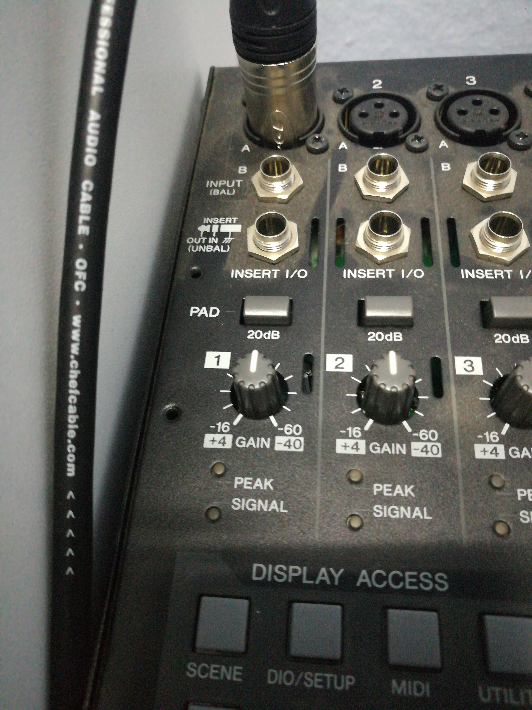

  它调整的是话筒输入调音台音量的大小，同时也是决定录音波形音量大小的旋钮，使我们录音时主要要调整的。旋钮旋到0（中间）意味着输入音量为正常值，向右为增大，向左为衰减。
+ `电平表`实时监测当前各个话筒输入调音台的音量大小，量表数值到0意味着录音音量达到了极限值，继续以极限状态录音会使得录音质量极差，请一定要防止这样的情况发生。

#### ==*一定要防止*，**一定要防止**，***一定要防止***。==
---
### 二、 监听与开关
[回到目录](##目录) 

+ 请留意调音台的监听耳机以及其插口。耳机插口在调音台的右上角，请注意不要被耳机线绊到以防耳机转接头断裂。
+ 耳机接口下方灰色旋钮为耳机`监听音量旋钮`，请在监听时适当旋转以调整至合适的音量。
  + 耳机监听音量旋钮旁边的是音响监听音量旋钮。在话筒与音响距离较近时，请确保音响音量较低低值以免引起音响自激啸叫，影响您的听力。
+ 在录音开始后尽量==将音响监听旋钮调至最低或手动关闭监听音箱==，否则录音可能会出现异样状况。
+ 如果调音台屏幕处于关闭状态，请检查调音台背后的电源开关是否已按下。

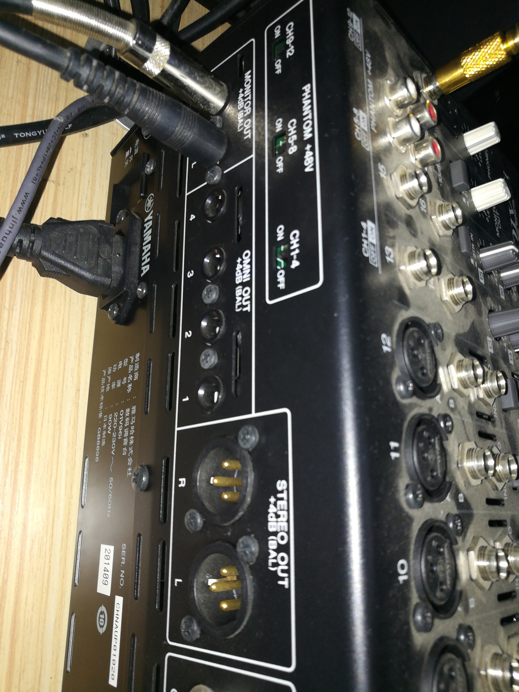

  + 若您在试音阶段发现调音台没有示数，请先确认调音台背后的`幻象供电开关`是否已打到正确位置。
  + 若已打开全部开关但调音台电平表仍无读数，则根据下一节操作进行排查。
---
### 三、 录音的准备阶段
[回到目录](##目录) 
+ 在录音开始前，请确保`音响监听旋钮`已向左旋至最低值。

+ 将`红色推子`、即将用到的各轨道`监听推子`以及相应的`增益旋钮`调至0。
  
  >例如：后文中的多人录音实例中需要用到两条轨道两只话筒，就需要同时将红色推子，1、2轨道的监听推子，1、2轨道的增益旋钮调节至0.
  
+ 确认您当前所使用的的轨道上的<kbd>**ON**</kbd>按钮已被点亮，否则调音台电平表将不会有示数。

+ 请根据监听耳机内的声音来判断自己与麦克风的距离是否合适。如果与麦克风的距离太近，您会很明显地听到自己的声音十分沉闷。
  + 为确保您的录音质量，请确认麦克风正面朝向您。如图所示为麦克风的正面，在底部有一个明显的商标，接线处也有一个凸起的小扣。
  
  

  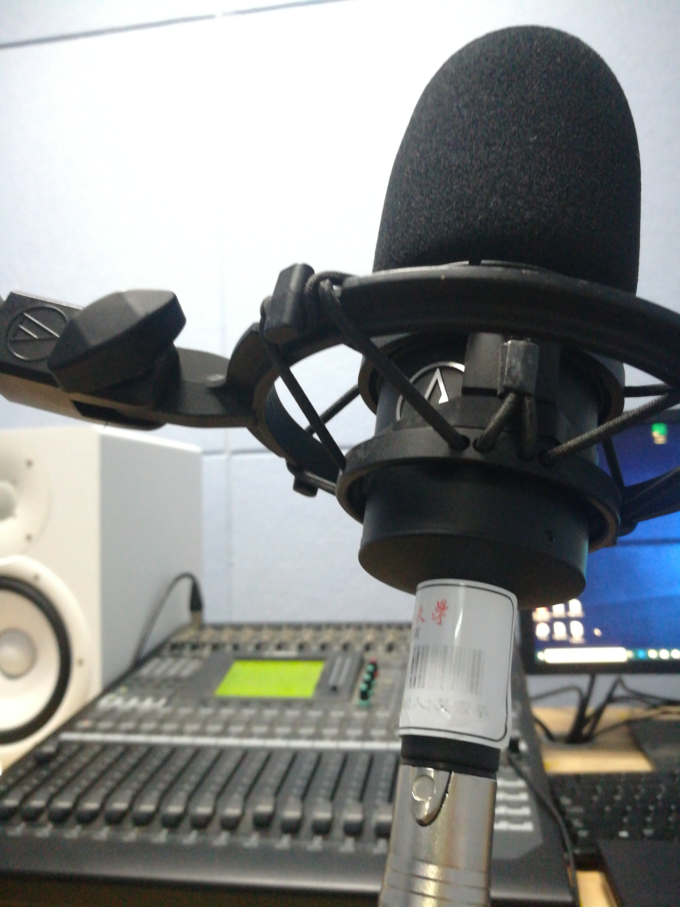
   话筒正面
  

  

  + 若是在耳机内听不清自己的声音，请确认`监听耳机音量旋钮`是否旋至适当的位置，或是临时将当前麦克风所在轨道的`监听音量推子`推高。 
  
+ 现在请将目光聚焦在调音台的电平表上，以平稳的状态开始念稿试音，边试音边调整话筒所在轨道的增益旋钮，以使得电平表示数能够尽量落在黄色区间内。

+ 若是在稿件中需要您将声音提高到比较激烈的程度，请务必在试音阶段确认清楚届时是否需要额外的音量衰减手段来保证录音音量不超过0（或是电平表的红色区域）。
  + 衰减手段1：调音台增益旋钮上方有一个<kbd>PAD</kbd>按钮，
  
  
  
  

在按钮被按下的状态，可以将录音音量降低20dB。
  + 衰减手段2：话筒底端有一个`PAD`开关，

  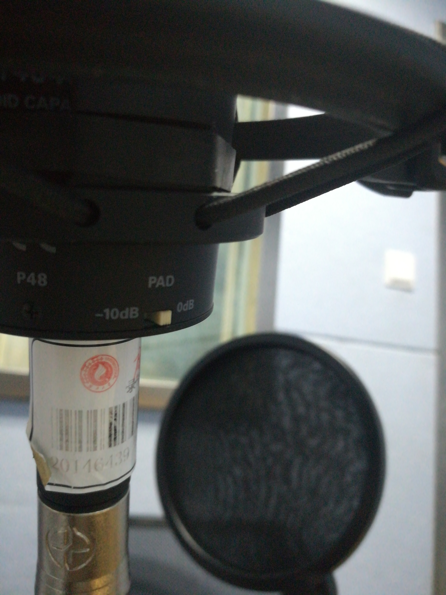

将其抠到-10dB档可以使得录音音量降低10分贝，同时在某种程度上可以降低噪音。

+ 录音前如果可以请关闭空调以免给后期人员增加不必要的麻烦，也请录音间内不在话筒前的同学**不要小看电容式麦克风的灵敏度**，在墙上擦来擦去的声音对于后期来说是极易听见也是极其反感的。
---
### 四、软件调整
[回到目录](##目录) 
+ 如果录音录不进去或者可以录音但会有异常状态：
  + Audition
    + 请打开`编辑`->`首选项`->`硬件设置`，将该界面设置为如下：
      
      
  
+ 如若您无法将其设置成功，请继续看下一节或是[打开reaper](#附：大型录音工程的操作)。
+ 听不到电脑的声音：  
  + Windows
    + 对Windows桌面右下角的小喇叭图标点击右键，选择音频设备选项。
    
    
    
  
+ 在“录制”选项卡中将“Yamaha 01v96i”启用
  
    
  
+ 若仍遇到困难
    + 确认调音台与电脑的接线是否连接完好。
    + 请重启，或祈祷下次有人来之后会把问题解决。

---
### 五、正式操作
[回到目录](##目录) 
> 本部分内容基于Adobe Audition 2019.如若您使用的是其他软件，请自行查阅相关资料。
+ 点击`文件`->`新建`->`音频文件`，或者在键盘上按<kbd>下Ctrl</kbd>+<kbd>Shift</kbd>+<kbd>N</kbd>，打开新建音频文件对话框。
+ 尽量将参数调整为如下图所示。如若有其他需要，可以酌情修改。

+ 点击电平表上方的红色按钮，开始录音。

> 在这里建议您在英文输入法模式下使用快捷键Shift+空格键来进行录音，这样可以略微降低鼠标尖锐声音对录音的影响。
+ 一段稿件录制完毕后，按下`空格键`可以停止录音。
+ 如果稿件录制完毕后，其中有读错的地方，按住鼠标左键拖动选中读错的时间区间。打开下方的`循环按钮`可以在您按下`空格`后反复播放选中的时间区间，以便您实时调整区间长度以及位置，确认该区间是正确的时间区间

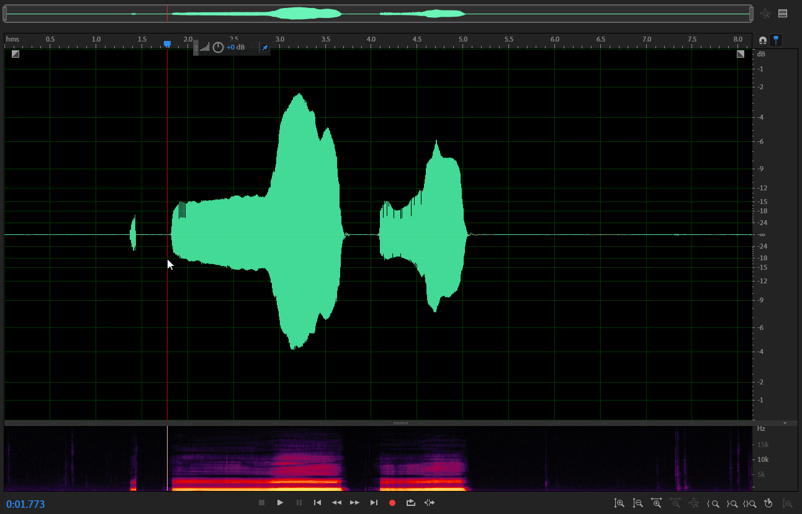

+ 在录音时请确认`循环按钮`已关闭，以免造成不必要的麻烦。
+ 对红色录音按钮点击右键，选择“插入开拍模式”，此时录音按钮变成了如下图所示。再次录音会自动预留回卷时间以供您准备状态以及防止杂音录入。

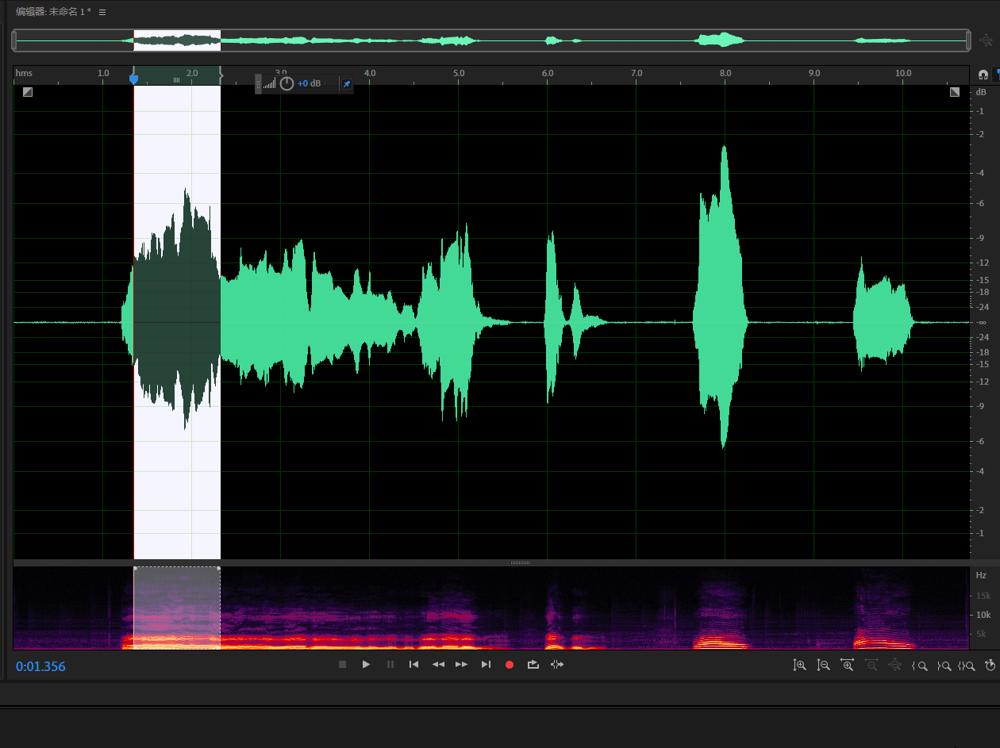

  + 此时再次录音会自动预留回卷时间以供您准备状态以及防止杂音录入。
  + 当时间指针走到您需要录音的区间左边缘时，录音正式开始，您可以对这一句以正确的读音和语调来进行录音。
  + 当时间指针走到区间的右边缘时，录音自动结束。
  > 通过该录音功能，您可以灵活高效地对录音进行重录处理。
+ 如果需要继续录音，请点击录音的结尾处将时间指针放至在那里，以免开始录音后覆盖之前正确的录音，并对录音红点点击右键，将录音模式改为第一种模式。

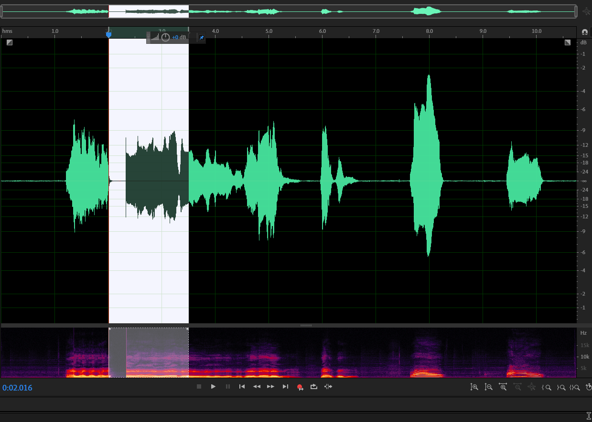

  > 如果想要放弃刚刚的录音或者撤回覆盖录音的操作等，按<kbd>Ctrl</kbd>+<kbd>Z</kbd>可以撤回上一步错误的操作。

+ 录音中如果出现了您不希望听到的声音，请按住鼠标左键拖动以选中相应的时间区间，按下键盘上的Delete键以删除这段声音。

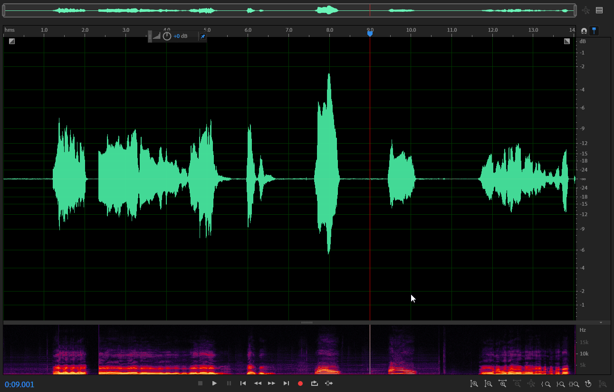

+ 录音结束后，如果想保存录音，请点击`文件`->`导出`->文件或按下键盘上的快捷键<kbd>Ctrl</kbd>+<kbd>Shift</kbd>+<kbd>E</kbd>(英文输入法下），此时会弹出导出文件对话框。

  + 如果您想要以无损音质保存您的录音，请将格式选择为wave PCM，此时会将录音导出为wav格式。
  + 如果您想要以较小的体积打包自己的录音，请将格式选择为MP3音频。
    
---
### 附：大型录音工程的操作
[回到目录](##目录) 

在这里本人强烈推荐使用reaper作为录音软件，她的强大功能可以让您耳目一新，涵盖Au所有的录音功能，全新的操作方式让录音更有效率，不仅可以用于单人录音，更能胜任多人录音任务。下面给出Reaper下的双人录音参考方案。当然此方案亦可用于更多人的录音。
+ #### 事前准备

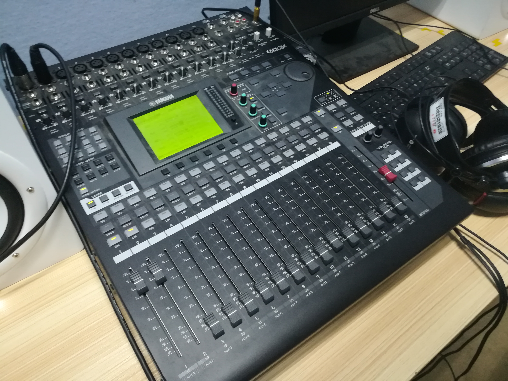

  + 把新的话筒搬到录音间，插到调音台相应的卡农口上，记下插有话筒的通道对应卡农口的编号，这里是1、2.
  + 将调音台后的两条连接音箱的线拔掉
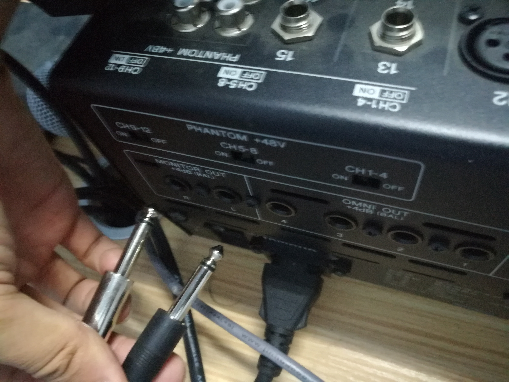

  + 连上从其他录音间拿来的新耳机作为第二人的监听耳机。
 

  + 此时我们调整音箱的音量旋钮可以调整这只耳机的监听音量。
  + 确认刚刚的2通道的<kbd>Enable</kbd>已点亮，即可按照上面“录音的准备阶段”部分对第二条话筒通道进行调整。

+ #### 软件操作
  + 双击图标打开Reaper。
  
  
  

  + 点击`文件`->`新建工程`或按下快捷键<kbd>Ctrl</kbd>+<kbd>N</kbd>。
  + 双击侧边空白可以新建轨道，这里新建两条轨道。
  + 点击第二条轨道上的黑色小三角，在下拉菜单中，将“输入：单声道”修改为刚刚插入的卡农口所对应数码的通道。这里为==01v96i ***02***==。
  
  
  
+ 接下来将所有要录音的轨道左端的红色录音准备按钮点亮，相应轨道的右端会显示其录音音量。
  
  
  
+ 按Alt+G关闭页面中的网格。这些网格会妨碍你的录音。
  
  
  
  :arrow_down_small:
  
  :arrow_down_small:<kbd>Alt</kbd>+<kbd>G</kbd>
  
  :arrow_down_small:
  
  
  
+ 点击下方的红色录音按钮或按下快捷键<kbd>Ctrl</kbd>+<kbd>R</kbd>即可开始对两条轨道同时录音。
  
  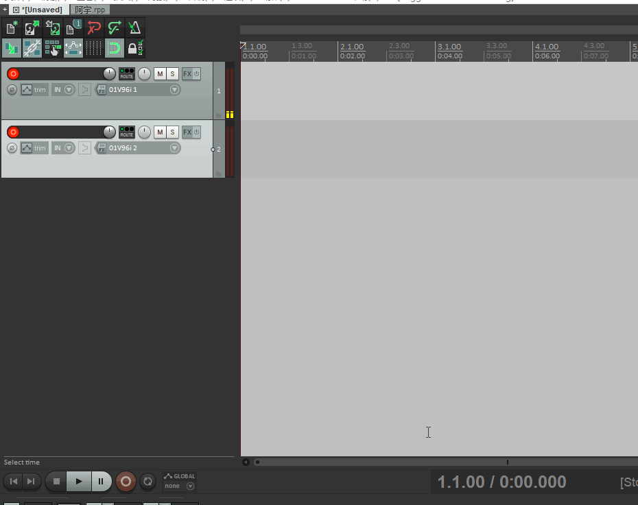
  
  + 如果您对刚刚的录音不满意，可以用鼠标点击轨道下方空白处的任意位置来跳转时间到要重新录音的地方，然后再次开始录音。
  
  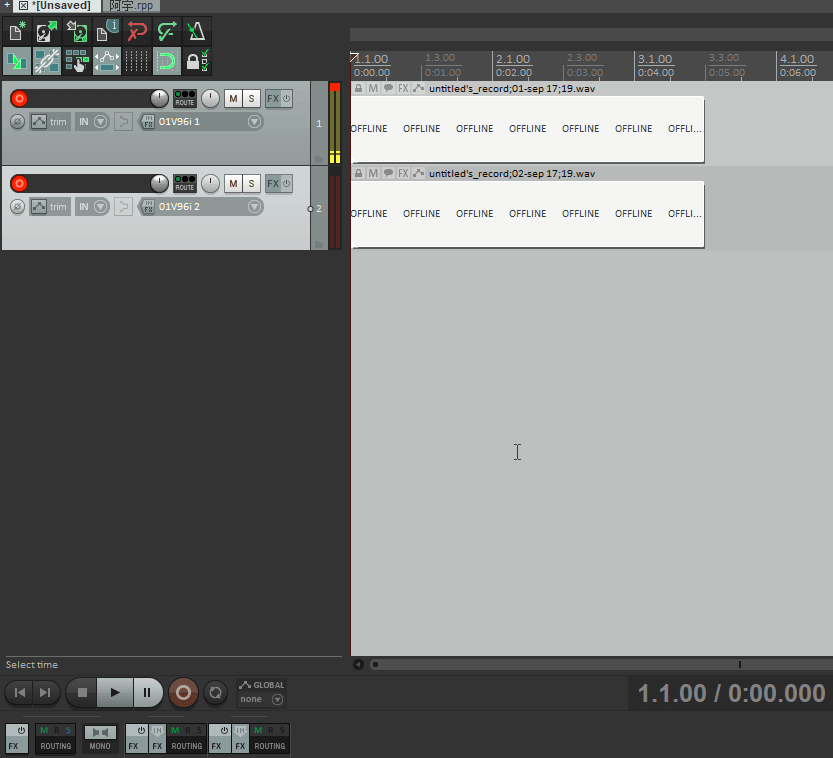
  
    + 两次录音结束后，Reaper会保留两次录音的波形作为“*可选片段*”。
  
  
    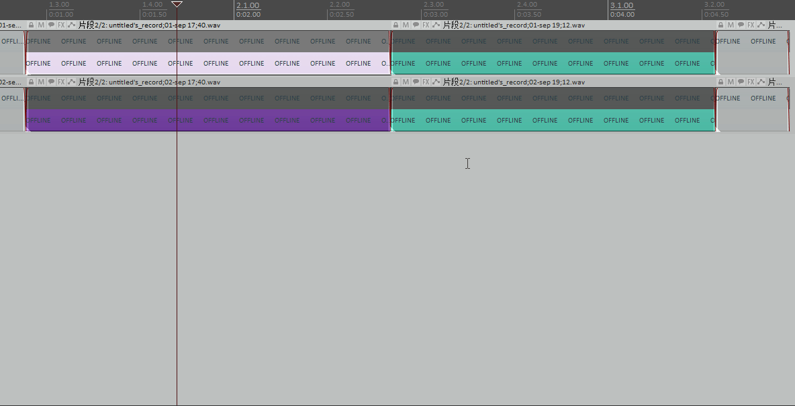
  
  
    + 多次录音的“片段”可以在录音结束后通过单击相应的片段来选择让某一片段激活。被激活的片段处于高亮状态，这一“*对象*”（也就是被分割出来的音频块）便只播放这一个“片段”；其余各次录音的片段处于灰色便被屏蔽静音。
    + 完成录音后可以调整所有“对象”的片段，以在最终录音中保留最佳录音。
  + 右击红色录音按钮，可以发现Reaper的录音有三种模式，这两种模式可以让您在有前句录音承接的情况下进行重录，有利于您更好地调整重录状态，快速完成录音。
    + 其中第二种模式类似于Au中的“即时开拍”模式，按住鼠标左键在轨道页面拖动即可作时间选区。您可以自行探索其余Au的区别。
    
    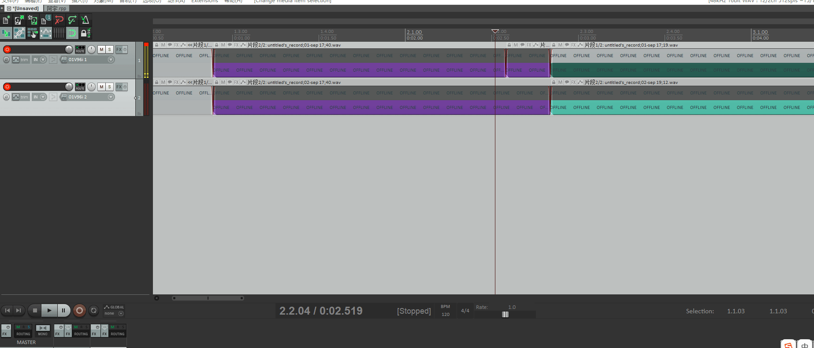
    
    + 第三种录音模式：按照选中对象自动切入/切出类似第二种模式，只是录音的范围并不是时间选区而是对象。
    + 在启用第二第三种录音模式时，如果录音范围之外留有未被收入的声音时，可以按住Alt拖动*片段*波形，左右滑动音频，直到所有有效声音皆进入录音范围内。
    
    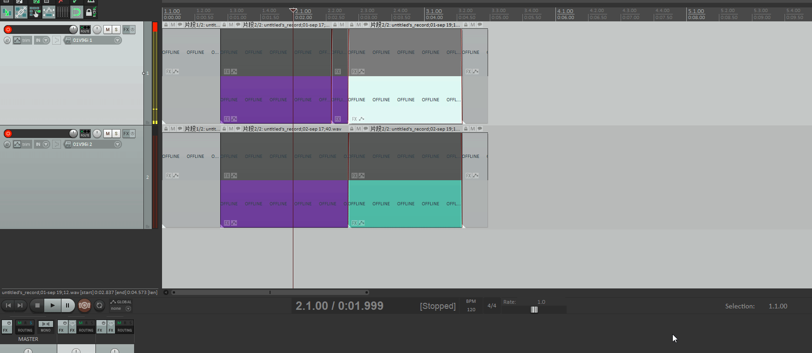
    
  + `录音结束后点击文件`->生成或键盘快捷键<kbd>Ctrl</kbd>+<kbd>Alt</kbd>+<kbd>R</kbd>，打开Render窗口。
    + 如果想要无损音质的录音，请按照下面的参数进行设置。
    
    
    
  + 如果想要小体积的录音，请按照下面的参数进行设置。
    
    

## 后记：
  [Reaper](https://docs.reaget.com/)是个神奇的软件，它免费，灵活，可定制，还有很多很多你意想不到的功能。有时间的话可以去了解一下这个软件的更多功能，你会发现一个全新的世界。

  [再看一遍](##目录) 